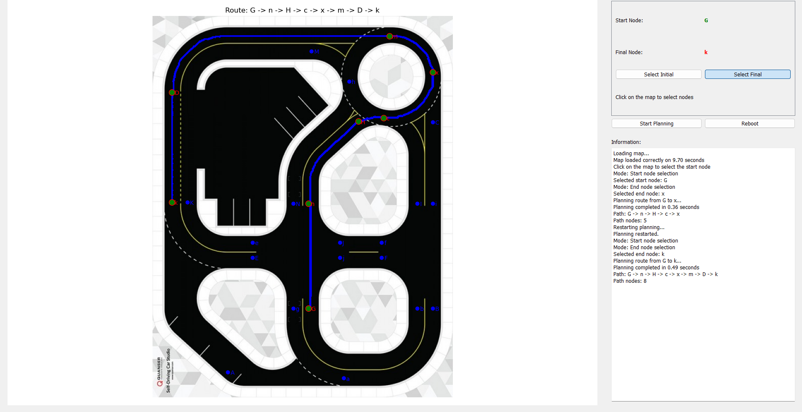
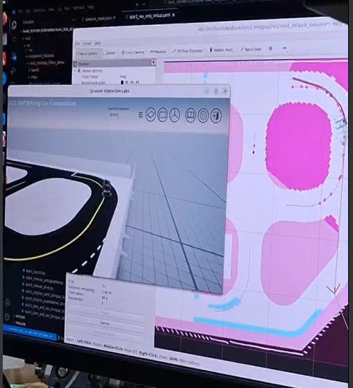

# Autonomous Navigation for QCar2 –  Quanser Competition

This project was developed remotely for the **Quanser Self-Driving Car Student Competition 2025** using **QCar2** and the **Quanser Interactive Labs platform**. It focuses on autonomous navigation, perception, and decision-making in structured environments.

## Project Highlights

- Built a **graph-based map** of the competition scenario and implemented a **custom A\*** algorithm for path planning, considering **lane directionality** and **pedestrian crosswalks**.
- Used **occupancy maps** for static environments and integrated **real-time obstacle detection** to improve safety and adaptability.
- Applied **YOLO-based machine learning models** to detect **traffic signs**, **lights**, and **pedestrians**, enabling reactive behaviors during navigation.
- Configured **NAV2** with LiDAR-based localization for high-accuracy movement planning.

> ⚠️ *Note: ROS 2 code and specific configurations are not shown here as they are part of an ongoing research project.*

---

## Tools & Technologies

- Isaac Sim (NVIDIA) - Quanser Interactive Labs
- ROS 2 & NAV2 (conceptual use)
- Python
- YOLO v11 (Object Detection)

---

## Gallery

*GUI Overview*

*Navigation Algorithm*
